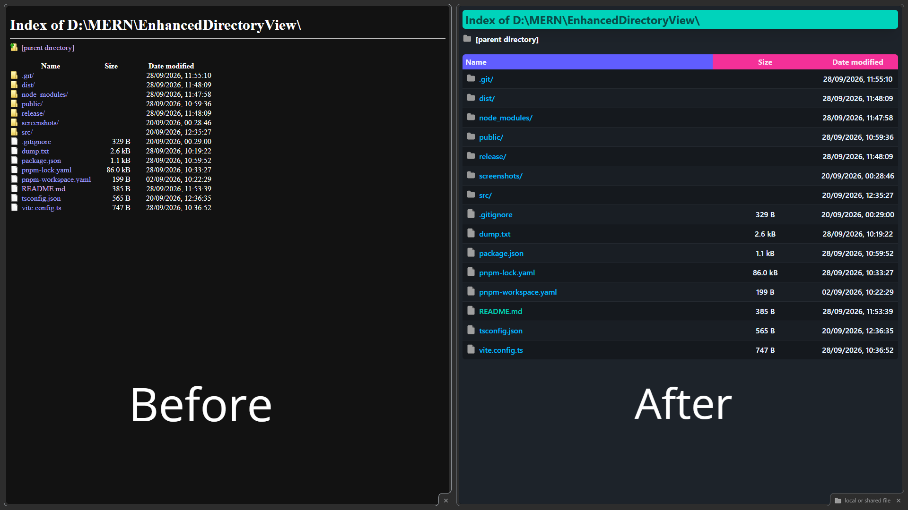

#  EnhancedDirectoryView

**EnhancedDirectoryView** restyles the browser's native `file://` directory listing — that plain, unstyled "Index of /" table — into a modern, clean interface using Tailwind CSS v4 and DaisyUI 5. No settings, no configuration: install it and your local folder views just look better.



## Why

When you open a local folder in your browser (`file:///D:/projects/...`), you get a bare-bones HTML table with default styling — no icons, no theming, tiny clickable areas. This extension replaces that with:

- **A themed card layout** — rounded header bar, zebra-striped rows, hover highlighting
- **Distinct file and folder icons** — injected as inline SVG backgrounds, one per entry type
- **Automatic light and dark themes** — follows your system preference via DaisyUI's `prefers-color-scheme` support
- **Sensible typography and spacing** — truncated long filenames, readable columns, smooth transitions
- **A proper favicon** — the page tab shows a folder icon instead of a blank file icon
- **Native behaviour preserved** — Firefox's column sorting still works (click the headers to sort)

## How it works

The extension is intentionally minimal — one content script and one stylesheet, no background worker, no permissions beyond `file:///*`:

1. A content script runs on `file://` pages and checks whether the document is a native directory listing (an `<h1>` starting with `Index of`).
2. If it is, the script tags the root element with `id="EnhancedDirectoryView"` and exposes the file/folder icon URLs as CSS custom properties.
3. The injected stylesheet scopes all styling under `html#EnhancedDirectoryView`, so it only ever affects directory listings and never leaks into normal pages.

## Installation

### From the release (temporary install in Firefox)

1. Download `EnhancedDirectoryView-1.0.0.zip` from the [`release/`](./release) folder (or the GitHub release) and unzip it.
2. Open `about:debugging#/runtime/this-firefox` in Firefox.
3. Click **Load Temporary Add-on…** and select the `manifest.json` inside the unzipped `dist` folder.

> Temporary add-ons are removed when Firefox restarts — Firefox requires signed extensions for permanent installs of self-built add-ons.

### From source

Requires [Node.js](https://nodejs.org) 20+ and [pnpm](https://pnpm.io):

```bash
git clone https://github.com/SoumabhaSaha15/EnhancedDirectoryView.git
cd EnhancedDirectoryView
pnpm install
pnpm build
```

Then load the generated `dist/` folder as described above.

## Development

| Command         | Description                                      |
| --------------- | ------------------------------------------------ |
| `pnpm dev`      | Start Vite in development/watch mode             |
| `pnpm build`    | Build the extension into `dist/` and zip it into `release/` |
| `pnpm compile`  | Type-check the project with `tsc --noEmit`      |
| `pnpm gen-icons`| Regenerate all extension icon sizes from `public/folder.svg` |

### Project structure

```
├── public/            # Static assets — icons and SVGs
│   ├── file.svg       # File entry icon
│   ├── folder.svg     # Folder entry icon (also the source for all extension icons)
│   └── icon/          # Generated extension icons (16–128 px)
├── src/
│   ├── main.ts        # Content script — detects listings and injects icon URLs
│   ├── index.css      # All styling, scoped to html#EnhancedDirectoryView
│   └── manifest.json  # Manifest V3
├── release/           # Zipped, ready-to-load builds
└── vite.config.ts     # Vite + Tailwind + web-extension + zip-pack pipeline
```

> **Note on `index.css`:** the heavy use of `!` (important) utilities is deliberate — the extension must override the browser's own user-agent styles for the directory listing, and specificity battles are not worth fighting here.

> ### You can change the theme with total 35 different themes. You have to modify `index.css` plugin and root scopes.  

## Credits

The project is inspired by [Enhanced File Explorer for Chrome](https://github.com/federicobrancasi/Enhanced-File-Explorer-for-Chrome) by [Federico Brancasi](https://github.com/federicobrancasi), reimplemented from scratch with TypeScript, Vite, Tailwind CSS v4 and DaisyUI 5, targeting Firefox's native directory listing.